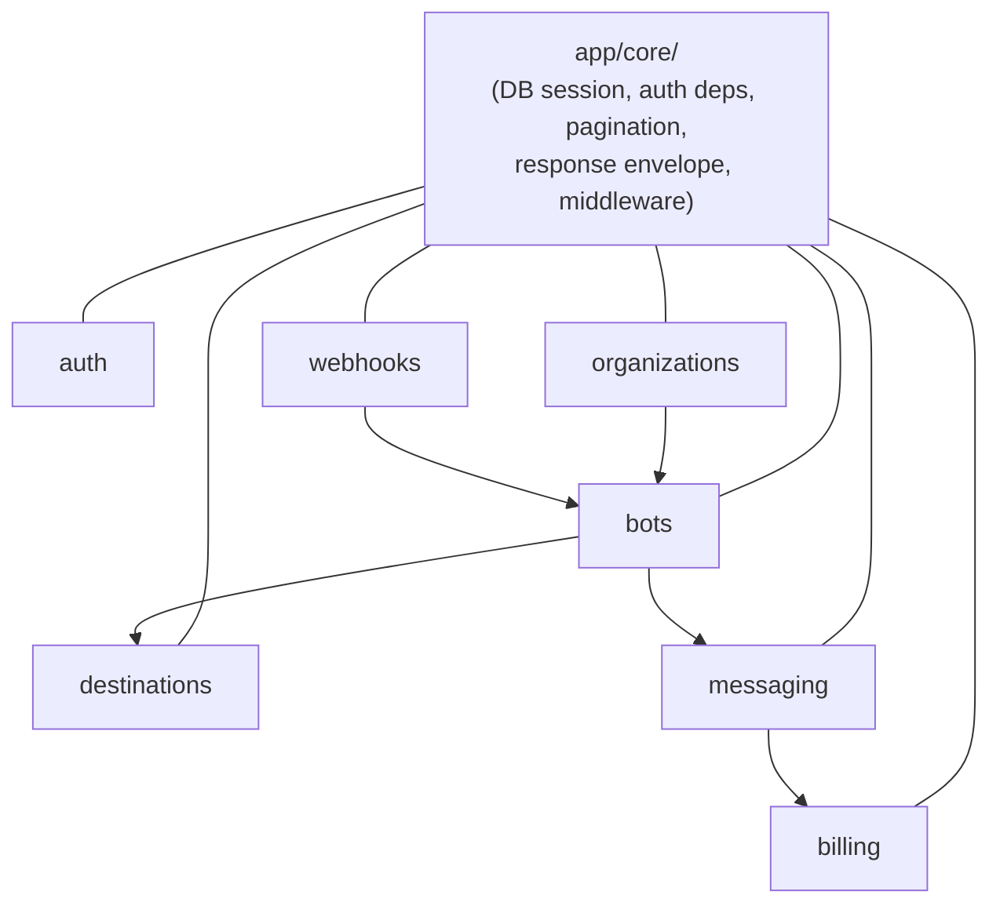

# Contributing to renot-api

Thanks for considering a contribution! This is a solo-maintained project —
external PRs are welcome, and the maintainer reviews/merges them.

## Dev setup

```bash
python -m venv .venv
source .venv/bin/activate
pip install -r requirements-dev.txt

cp .env.example .env.development
# edit .env.development with your local values

docker compose -f docker/docker-compose.yml up   # Postgres, Redis, Celery, the app itself
alembic upgrade head
```

See [README.md](README.md#getting-started) for the full setup walkthrough.
Every domain module (`auth`, `organizations`, `bots`, `destinations`,
`messaging`, `billing`, `webhooks`) follows the same
`router.py`/`service.py`/`repository.py`/`model.py`/`schema.py` shape —
see "Architecture" below for the full picture.

## Architecture

Top-level layout:

```
app/
├── core/           # Cross-cutting infrastructure (config, DB, auth deps, middleware, response envelope)
├── i18n/           # Error message translations (en/id)
├── modules/        # Domain modules (see below)
├── shared/         # Pure cross-module utilities (Telegram HTTP client, Telegram types)
├── worker/         # Celery worker entrypoint
└── main.py         # FastAPI app entrypoint
alembic/            # Database migrations
docker/             # Dockerfile + docker-compose for local dev
tests/
├── unit/
├── integration/
├── feature/
└── support/        # Shared fixtures (real Postgres via testcontainers)
```

This is a **Domain-Driven Modular Monolith**. Each domain lives under
`app/modules/<name>/` as a self-contained unit:

```
app/modules/<name>/
├── router.py       # HTTP endpoints — request in, service call, envelope out. No business logic.
├── service.py      # Business logic — the only place business rules live.
├── repository.py   # Data access — SQLAlchemy queries.
├── model.py        # SQLAlchemy models.
├── schema.py       # Pydantic request/response schemas.
├── exceptions.py   # Domain-specific exceptions (subclass AppException).
└── __init__.py     # The module's public interface — the ONLY thing other modules may import.
```

Modules: `auth`, `organizations`, `bots`, `destinations`, `messaging`, `billing`, `webhooks`.

Cross-module communication always goes through a module's `__init__.py`
interface — never `from app.modules.x.model import Y` across module
boundaries. This keeps each module free to change its internals without
breaking others, and keeps the dependency graph explicit.



## Soft-delete convention

Every tenant-scoped entity (anything built on `TenantScopedBase`, which adds
a `deleted_at` timestamp) is soft-deleted, never hard-deleted, and its
`repository.py` module docstring must say so explicitly:

- State that the default lookup methods (`get_active`/`list_active`, or
  equivalent) exclude soft-deleted rows.
- State whether a `with_deleted()`/`get_with_deleted()` variant exists for
  looking past the soft-delete. Only add one when a real caller needs it
  (e.g. `BotAssignmentRepository.get_with_deleted` exists because
  `service.assign_bot` reactivates a soft-deleted assignment instead of
  inserting a duplicate row) — otherwise say explicitly that no such variant
  exists, so the absence reads as a deliberate decision the next contributor
  can trust, not something nobody got around to.

Entities that opt out of the pattern entirely (e.g. `users`,
`organization_memberships` — hard-deleted or never deleted) should say so
just as explicitly in their own module docstring, rather than leaving it
unstated. See `app/modules/bots/repository.py`,
`app/modules/organizations/repository.py`, and
`app/modules/auth/repository.py` for worked examples of both cases.

## Testing

Tests are split into three tiers — pick the lowest tier that can prove your
change works:

| Tier | Location | Scope | Needs Docker? |
| --- | --- | --- | --- |
| Unit | `tests/unit/` | Pure logic, no DB/network | No |
| Integration | `tests/integration/` | Real Postgres, external calls (Telegram API, Celery dispatch) mocked, one module in isolation | Yes |
| Feature | `tests/feature/` | Full HTTP client journeys end-to-end, real Postgres, external calls mocked | Yes |

Full detail on what each tier is for lives in the docstrings at the top of
`tests/integration/conftest.py` and `tests/feature/conftest.py` — read those
before adding a new test in either tier.

Naming convention: `test_<behavior being verified>`, e.g.
`test_creating_a_bot_with_duplicate_token_fails`.

```bash
pytest tests/unit                       # fast, no Docker required
pytest tests/integration tests/feature   # spins up a Postgres container automatically
pytest --cov=app --cov-fail-under=95     # full suite with the coverage gate CI enforces
```

## Linting & type checking

```bash
ruff check .
black --check .
isort --check-only .
mypy app
```

Or install the pre-commit hooks so these run automatically on every commit:

```bash
pre-commit install
```

## Commit messages & PRs

Individual commits inside a PR can stay free-form — keep them short and in
the imperative ("add X", "fix Y"). **PR titles**, however, must follow
[Conventional Commits](https://www.conventionalcommits.org/) format
(`feat: ...`, `fix: ...`, `chore: ...`, `docs: ...`, etc.) — a CI check
(`pr-title-lint.yml`) enforces this on every PR, and only "Squash and
merge" is the intended merge method on `main` (a GitHub Settings choice,
configured separately), so the PR title becomes the actual commit message
on `main` that release-please's changelog reads.

PR flow:

1. Fork the repo, branch off `main`.
2. Make your change, with tests covering it.
3. Make sure `pytest`, `ruff`, `black --check`, `isort --check-only`, and
   `mypy app` all pass locally.
4. Open a PR against `main`. CI must be green before it can be merged.
5. Respond to review feedback — see [SUPPORT.md](SUPPORT.md) for what
   response-time to expect.

## Sign off your commits (DCO)

Every commit must include a `Signed-off-by` trailer, asserting you have
the right to submit the code under this project's license (MIT) — the
[Developer Certificate of Origin](https://developercertificate.org/). Add
it automatically with:

```bash
git commit -s -m "fix: some bug"
```

A CI check verifies every commit in a PR has this trailer. If you forgot,
amend it — `git commit --amend -s` for the last commit, or
`git rebase --signoff main` for multiple commits — then force-push.

## Code of Conduct

Participation in this project is governed by the
[Contributor Covenant Code of Conduct](CODE_OF_CONDUCT.md).
