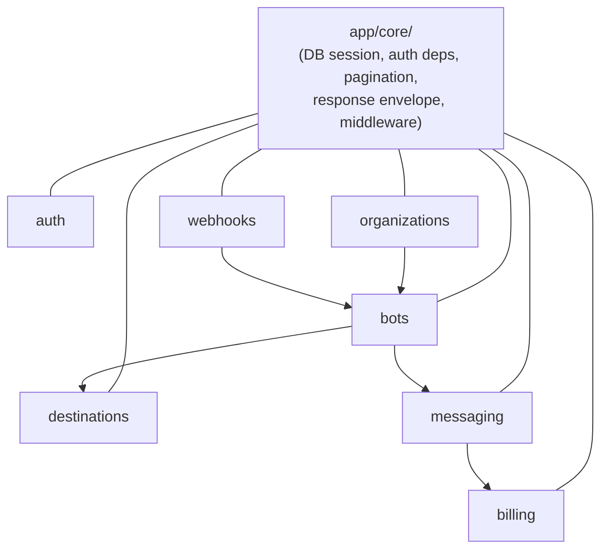

# RENOT API

[](https://github.com/<your-org>/renot-api/actions/workflows/ci.yml)
[](LICENSE)

> **Status:** Pre-1.0 (`0.x`), following [SemVer](https://semver.org/) —
> breaking changes may land in a minor release until `1.0.0`.

A multi-tenant B2B SaaS platform for centralized Telegram bot management — register Telegram bots, manage subscriber destinations (chats/groups/channels), and send/schedule messages (text, media, polls) with delivery tracking, usage metering, and per-plan retention.

## Quick example

```bash
curl -X POST https://your-domain.example.com/api/v1/messages \
  -H "X-Bot-Api-Key: <bot-api-key>" \
  -H "Content-Type: application/json" \
  -d '{
    "bot_id": "b3f1c2a0-1234-4a5b-8c9d-abcdef123456",
    "destination_ids": ["d1a2e4f6-1234-4a5b-8c9d-abcdef123456"],
    "content_type": "text",
    "text": "Deployment finished ✅"
  }'
```

```json
{
  "success": true,
  "data": { "message_id": "f4e2c1a0-1234-4a5b-8c9d-abcdef123456", "status": "queued" },
  "meta": { "request_id": "...", "timestamp": "..." },
  "error": null
}
```

See [docs/API_CONVENTIONS.md](docs/API_CONVENTIONS.md) for the full request/response shape, auth, and rate limits.

## Tech stack

- **FastAPI** (async) + **Pydantic v2** for the HTTP API
- **PostgreSQL** via **SQLAlchemy 2.0** (async) + **Alembic** for migrations
- **Celery** + **Redis** for background work (message dispatch, webhook metering, retention purge) and rate limiting
- **structlog** for structured JSON logging

## Architecture

This is a **Domain-Driven Modular Monolith**. Each domain lives under `app/modules/<name>/` as a self-contained unit:

```
app/modules/<name>/
├── router.py       # HTTP endpoints — request in, service call, envelope out. No business logic.
├── service.py      # Business logic — the only place business rules live.
├── repository.py   # Data access — SQLAlchemy queries.
├── model.py        # SQLAlchemy models.
├── schema.py       # Pydantic request/response schemas.
├── exceptions.py   # Domain-specific exceptions (subclass AppException).
└── __init__.py     # The module's public interface — the ONLY thing other modules may import.
```

Modules: `auth`, `organizations`, `bots`, `destinations`, `messaging`, `billing`, `webhooks`.

Cross-module communication always goes through a module's `__init__.py` interface — never `from app.modules.x.model import Y` across module boundaries. This keeps each module free to change its internals without breaking others, and keeps the dependency graph explicit.

Cross-cutting infrastructure (DB session, JWT/permission dependencies, pagination, the response envelope, exception handling, middleware) lives in `app/core/`. Shared pure utilities (the Telegram HTTP client, Telegram-specific Pydantic types) live in `app/shared/`.



## Getting started

### 1. Configure environment

```bash
cp .env.example .env.development
# edit .env.development with your local values
```

### 2. Start dependencies (Postgres, Redis, Celery worker/beat) via Docker

```bash
docker compose -f docker/docker-compose.yml up
```

This also starts the FastAPI app itself (`app` service) and `celery-flower` (a Celery monitoring UI at `localhost:5555`, dev-only).

To run the app directly on the host instead (e.g. for a debugger), install dependencies and run migrations first:

```bash
pip install -r requirements-dev.txt
alembic upgrade head
uvicorn app.main:app --reload
```

### 3. Run database migrations

```bash
alembic upgrade head
```

New migration:

```bash
alembic revision --autogenerate -m "description"
```

### 4. Explore the API

Once running locally, interactive API docs are available at
`http://localhost:8000/docs` (Swagger UI) and `http://localhost:8000/redoc`
(ReDoc). These are automatically disabled in production — see
[docs/API_CONVENTIONS.md](docs/API_CONVENTIONS.md) for the API reference
that stays available regardless of environment.

## Running tests

Tests are split into three tiers:

| Tier        | Location               | What it covers                                                                                                    | Needs Docker? |
| ----------- | ---------------------- | ----------------------------------------------------------------------------------------------------------------- | ------------- |
| Unit        | `tests/unit/`        | Pure logic, repositories/external calls mocked                                                                    | No            |
| Integration | `tests/integration/` | Router → service → real Postgres (via`testcontainers`), external calls (Telegram API, Celery dispatch) mocked | Yes           |
| Feature     | `tests/feature/`     | Full end-to-end user journeys over real HTTP                                                                      | Yes           |

```bash
pytest tests/unit                    # fast, no Docker required
pytest tests/integration tests/feature  # spins up a Postgres container automatically
pytest --cov=app --cov-fail-under=95    # full suite with coverage gate (matches CI)
```

## Linting & type checking

```bash
ruff check .
black --check .
isort --check-only .
mypy app
```

Or install the pre-commit hooks to run these automatically:

```bash
pre-commit install
```

## Documentation

- [CONTRIBUTING.md](CONTRIBUTING.md) — dev setup, testing, PR flow
- [CODE_OF_CONDUCT.md](CODE_OF_CONDUCT.md)
- [SECURITY.md](SECURITY.md) — vulnerability disclosure
- [SUPPORT.md](SUPPORT.md) — how to ask for help
- [docs/DATA_HANDLING.md](docs/DATA_HANDLING.md) — what's stored, retention, self-hoster backup guidance
- [docs/API_VERSIONING.md](docs/API_VERSIONING.md) — backward-compatibility policy
- [docs/API_CONVENTIONS.md](docs/API_CONVENTIONS.md) — pagination, rate limits, error format, auth
- [LICENSE](LICENSE) — MIT

## Project structure

```
app/
├── core/           # Cross-cutting infrastructure (config, DB, auth deps, middleware, response envelope)
├── i18n/           # Error message translations (en/id)
├── modules/        # Domain modules (see Architecture above)
├── shared/         # Pure cross-module utilities (Telegram HTTP client, Telegram types)
├── worker/         # Celery worker entrypoint
└── main.py         # FastAPI app entrypoint
alembic/            # Database migrations
docker/             # Dockerfile + docker-compose for local dev
tests/
├── unit/
├── integration/
├── feature/
└── support/        # Shared fixtures (real Postgres via testcontainers)
```
